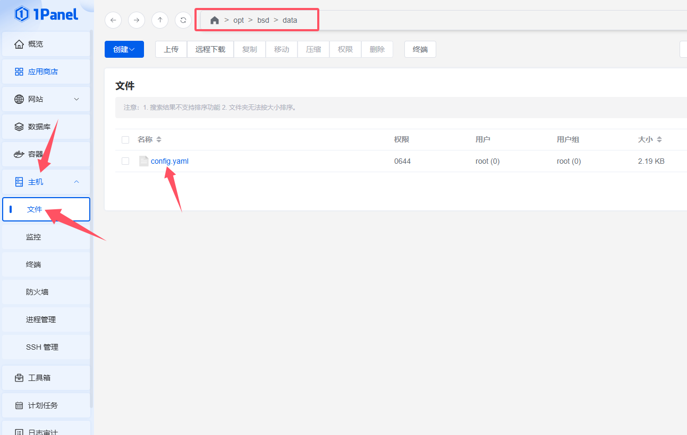
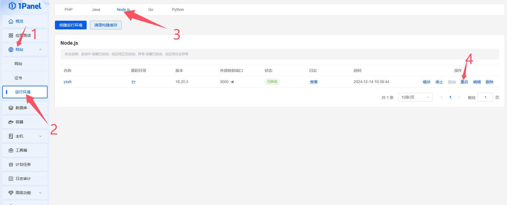
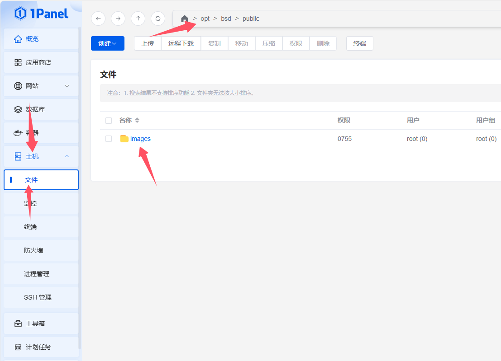

### 操作指南
1. 如果要修改数据，进入 `/opt/bsd/data` 目录下的 config.yaml     
   
语法如下：
```yaml
# 活动配置
activities:
  - title: 活动标题
    coverImage: 封面图的地址， 为于 public 目录的相对路径
    description: 活动描述
    date: 日期
    organizer: 组织者

  - title: 示例
    coverImage: /images/黄帝陵.JPG
    description: 黄帝陵
    date: 2024-07-22
    organizer: mei

# 下面是摄影作品展示的配置
showcase:
  - title: 壶口瀑布
    image: /images/壶口-2.JPG
    author: mei
    date: 2024-07-15
```

**配置更改完需要到 网站-运行环境-Node.js 中重启 ysxh**
   
2. 如果要上传图片，进入 `/opt/bsd/public` 目录，将图片放在此目录下，Node 会自动优化图片      
         
访问上传的图片地址逻辑是： 例如在public目录下上传了一个 1.jpg 文件，那么你在第一个步骤中封面图的地址就应该填写 `/1.jpg`,不过建议创建目录来管理 